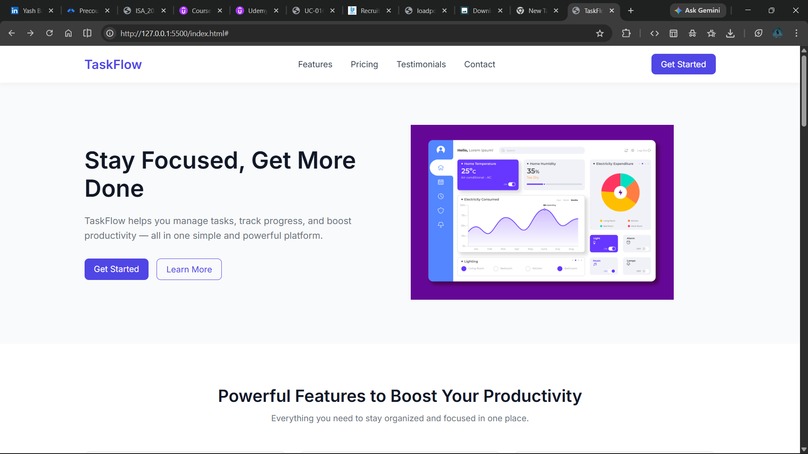
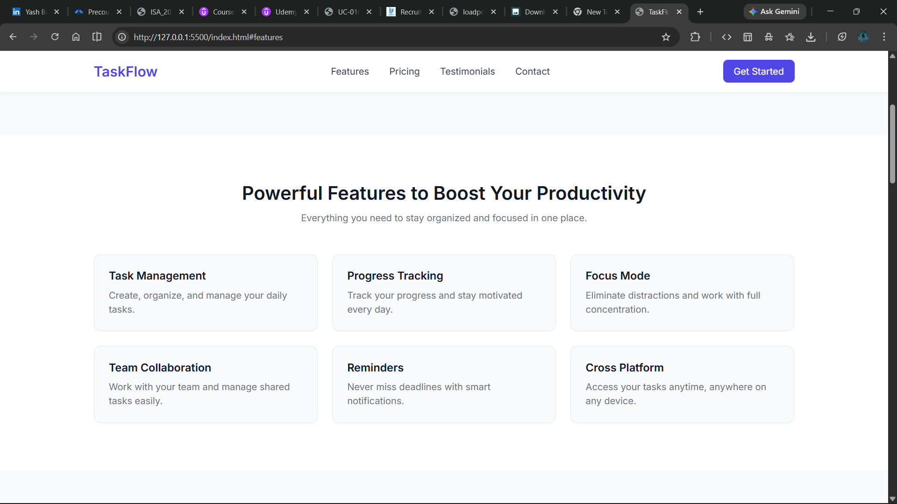
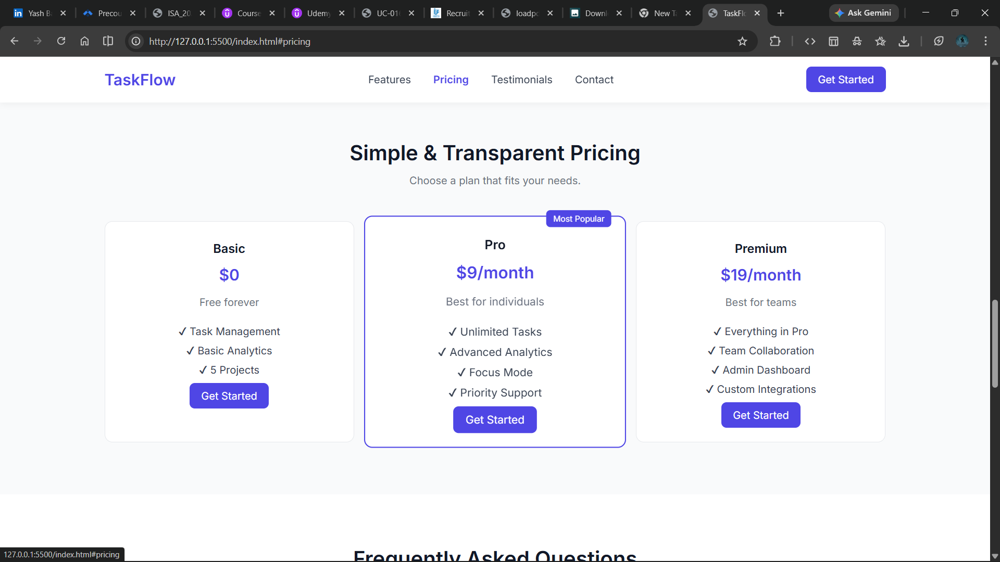
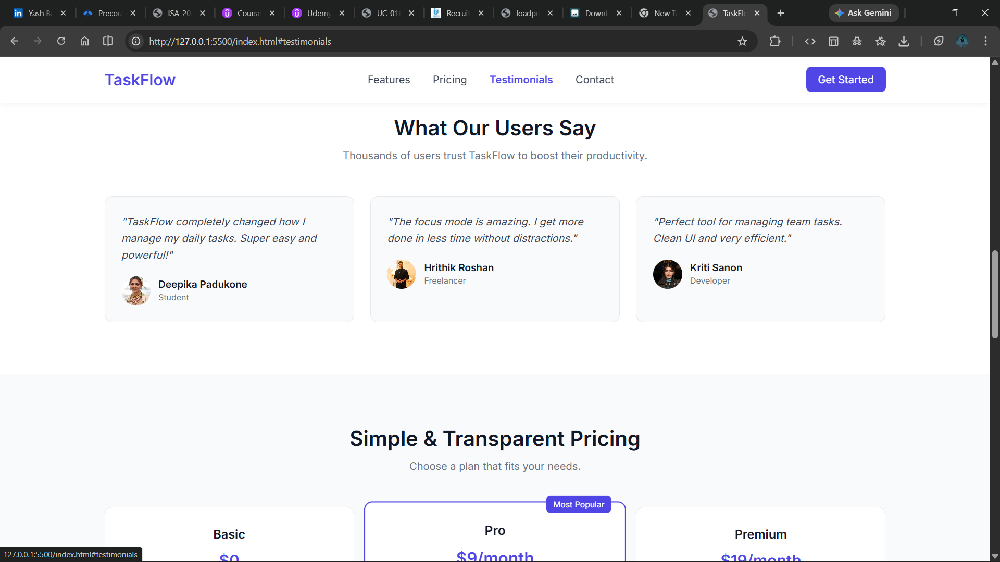
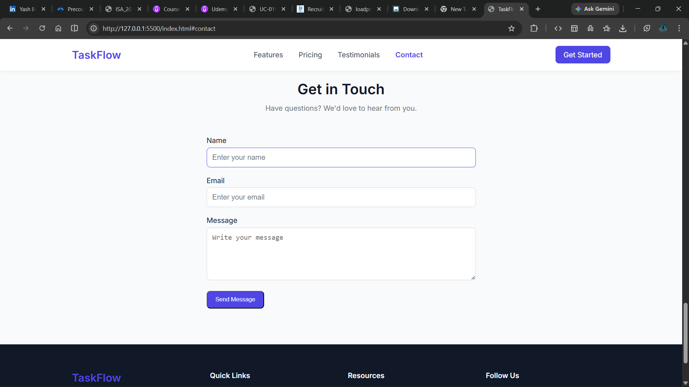

# TaskFlow Landing Page

## 🚀 Overview

TaskFlow is a modern SaaS landing page designed to showcase a productivity tool that helps users manage tasks and stay focused.

## ✨ Features

* Responsive design
* Smooth scrolling navigation
* Active navbar highlighting
* FAQ accordion
* Form validation
* Toast notifications

## 🛠️ Tech Stack

* HTML
* CSS (Flexbox + Grid)
* JavaScript

## 📱 Responsive

Fully optimized for:

* Mobile
* Tablet
* Desktop

## 🔗 Live Demo

https://taskflow-landing-alpha.vercel.app/

## 📂 How to Run

1. Download project
2. Open index.html in browser

## 📸 Screenshots

---

Built with ❤️ by Yash
